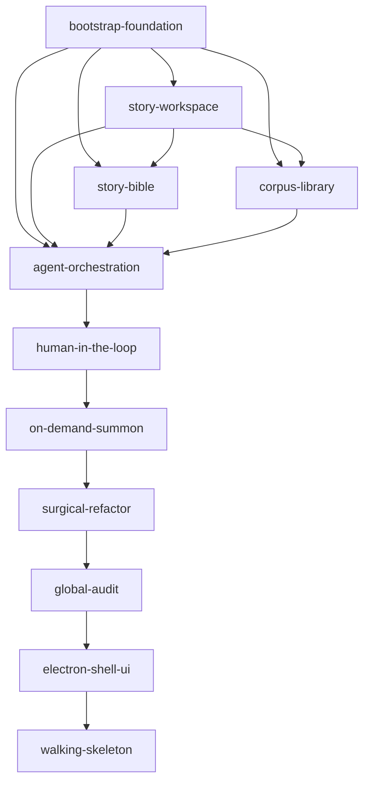

# 构建路线图 (Build Roadmap)

> 本文件是 change **构建/激活顺序**的唯一权威来源。
> `openspec list` 按修改时间/字母排序，**不理解依赖**，不能作为顺序依据。
> 每个 change 的 `.openspec.yaml` 里的 `wave` / `depends_on` 字段与本文件保持一致。

## 交付策略

- **以顺序为主，并行只发生在 W2**。依赖链基本是一条线，强行并行会导致“契约未定就被引用”的返工。
- 唯一可并行处：`story-bible` 与 `corpus-library`（都只依赖 W0+W1，彼此正交、写入范围不重叠）。
- 每个 change 开发完成、`openspec validate <id> --strict` 通过并合入后，才进入下一波次。
- 现阶段全部为 spec，尚未开发，因此均**未 archive**，根 `openspec/specs/` 为空属正常。

## 依赖 DAG

> W0–W8 为**契约地基阶段**（只产出 `core/` 契约 + 纯函数，不写运行时/UI 代码）。
> 自 **I1 `renderer-react-shell`** 起进入**实现阶段**：落地 renderer/main/workers 运行时代码。

## 波次表

| 波次 | Change | 并行 | 直接依赖 |
|------|--------|------|----------|
| W0 | `bootstrap-foundation` | — | （根） |
| W1 | `story-workspace` | — | bootstrap-foundation |
| W2 | `story-bible` | ‖ 与 corpus-library 并行 | bootstrap-foundation, story-workspace |
| W2 | `corpus-library` | ‖ 与 story-bible 并行 | bootstrap-foundation, story-workspace |
| W3 | `agent-orchestration` | — | bootstrap-foundation, story-workspace, story-bible, corpus-library |
| W4 | `human-in-the-loop` | — | agent-orchestration（+ bootstrap-foundation, story-bible） |
| W5 | `on-demand-summon` | — | human-in-the-loop（+ agent-orchestration, story-workspace, story-bible, corpus-library） |
| W6 | `surgical-refactor` | — | on-demand-summon（+ story-workspace, agent-orchestration, human-in-the-loop） |
| W7 | `global-audit` | — | surgical-refactor（+ story-bible, story-workspace, human-in-the-loop, agent-orchestration） |
| W8 | `electron-shell-ui` | — | 以上全部 |
| I1 | `walking-skeleton` | — | electron-shell-ui（+ 其消费的各前端触点 change） |

> 括号内为“同时依赖的更早波次能力”，不影响波次归属（波次 = 最深依赖 + 1）。

## 线性构建顺序（顺序开发时逐一推进）

1. bootstrap-foundation
2. story-workspace
3. story-bible
4. corpus-library
5. agent-orchestration
6. human-in-the-loop
7. on-demand-summon
8. surgical-refactor
9. global-audit
10. electron-shell-ui
11. walking-skeleton（实现阶段第 1 波：端到端真数据行走骨架）

## 实现阶段路线（Implementation Phase，I1–I8）

> W0–W8 是**契约地基阶段**（只产出 `core/` 类型契约 + Zod + 纯函数，不写运行时/UI 代码）。
> 地基完成 ≠ 产品可用；地基完成 = 蓝图与预制构件就绪。**真正“能当生产力工具用”在实现阶段兑现。**
> 以下每一波都是“填实现”而非“再设计”（契约已定、返工风险低），但工作量真实存在。

### 波次规划

| 波次 | Change（拟名） | 内容 | 规模 | 累计产品完整度 |
|------|----------------|------|------|----------------|
| ✅ | W0–W8 | 契约地基（10 change 全绿） | — | 骨架 100% / 产品 ~5% |
| ✅ I1 | `walking-skeleton` | 真读小说 + 真 LLM 流式 + React/Tailwind/TipTap 三轴界面（单 agent 直调、无持久化、无编排） | 中 | ~25% |
| ✅ I2 | `persistence-sqlite` | SQLite 持久化：正文 / 事实库 / 版本 / checkpoint（Electron 37 / Node 22 内置 `node:sqlite`） | 中 | ~35% |
| ✅ I3 | `orchestration-runtime` | LangGraph 多智能体真编排 + 手刹中断/恢复/时间旅行 + 历史事实检索与章号纠偏（**最硬一波，产品灵魂**） | 大 | ~55% |
| ✅ I4 | `story-bible-extraction`（+ UI 批次） | 事实库自动抽取：读正文 → 时间线/人设/伏笔入库；含确认/编辑/合并删除/面板/抽取UI/冲突裁决/变更自动刷新等一整批 story-bible-* change | 大 | ~70% |
| ✅ I5 | `audit-worker-runtime` | 全书总检 Map-Reduce worker：红黄牌真产出（首个 utilityProcess worker 运行时落地，fork 不可用回退内联、语义一致） | 中 | ~80% |
| ✅ I6 | `refactor-worker-runtime` | 局部重构 diff/hunk worker：改文字真拼回落库 | 中 | ~88% |
| ✅ I7 | `corpus-worker-runtime` | 素材库 embedding 检索 worker | 中 | ~93% |
| ✅ I9 | `agent-roster-expansion` | 多专家 agent 阵容：把 fact-checker/scene-generator/plagiarism-checker/editor/style-editor/architect/character-generator/worldbuilding 接成真图节点 + 召唤路由 + 外置提示词运行时（详见下方子阶段 A–E） | 大 | ~92% |
| ✅ I10 | `ui-overhaul` | agent 阵容齐备后的大规模 UI 调整（承载多 agent 召唤/编排可视化/看板等；详见下方子阶段） | 大 | ~97% |
| ✅ I8 | `visual-design` | 视觉设计打磨（配色/排版/动效/主题）| 中 | ~100% |

> 完整度为**产品可用性**的粗略估计，非精确进度；用于建立“还剩几关、每关干啥”的预期。
> 各波 change 的正式 proposal/spec 在进入该波前起草，名称与拆分可能微调。
> **顺序说明**：I9 依赖 I3（编排运行时，已绿）+ I4（事实抽取，已绿）；其子阶段 D（editor/style-editor）另依赖 I6 的 diff/hunk 通道。I8 视觉打磨始终压到最后。

### I9 `agent-roster-expansion` 子阶段（多 agent 扩展的展开）

> 本波把上一阶段“扩展 agent 阵容”这条被低估的 later-priority 正式展开为 5 个子阶段，逐一独立成 change、独立校验。

| 子阶段 | 内容 | 依赖 |
|--------|------|------|
| ✅ A | 打通「召唤→agent→action→节点」死路（`#initialState` 按 agent 映射 action）+ 落地首个新节点 `fact-checker`（诊断态、产 ConsistencyIssue[]、复用 reviewer 裁决/路由基建） | I3, I4 |
| ✅ B | `prompt-loading` 运行时：外置中文 YAML 读盘 + 校验 + 回退；迁移 writer/reviewer/fact-checker 提示词为资产（含 electron-vite 资产拷贝 + smoke 构建兼容） | A |
| ✅ C | 写作类 `scene-generator`（走写-审-改环）+ 审校类 `plagiarism-checker`（产 ConsistencyIssue[]） | A（B 优先） |
| ✅ D | 重构类 `editor` / `style-editor` 落为可达节点（产片段级改写建议对话、绝不整章覆盖）；正文 diff/逐 hunk 拼回落库通道已由 I6 `refactor-worker-runtime`（后端）+ `refactor-review-ui`（渲染层改写审阅面板）接入 | A |
| ✅ E | 策划类 `architect`(outline) / `character-generator` / `worldbuilding`（定义产物落地 story-bible 的写入契约） | A, I4 |

### I10 `ui-overhaul` 子阶段（多 agent UI 收口的展开）

> I9 落地 10 个专家 agent 后，UI 侧只能召唤其中错位的 3 个。本波把「大规模 UI 调整」展开为可独立成 change、独立校验的子阶段，逐一收口。

| 子阶段 | 内容 | 依赖 |
|--------|------|------|
| ✅ A | 多 agent 召唤目录：core 建权威 `AGENT_CATALOG`（`Record<EXPERT_NODES>` 编译期穷尽、与图拓扑不漂移），命令面板改目录驱动、按类别分组，补齐全部 10 个专家的 UI 可召唤性；对话轴自由提问默认 agent 由写死 writer 改为目录默认诊断 agent | I9 |
| ✅ B | agent 身份可视化：对话轴按 `DialogueMessage.author` 显示发言专家（名/类别徽标），区分 author/各专家；召唤运行标注目标 agent | A |
| ✅ C | 编排/看板可视化：architect 看板视图（时间线轴/情节线/人设集，数据来自后端）+ 多 agent 召唤运行的编排态呈现 | A, I5 |

## 校验约定

- 修改任一 change 的依赖时，必须同步更新：该 change 的 `.openspec.yaml`（`wave`/`depends_on`）、本文件的
  波次表与 DAG。三者不一致视为错误。
- `depends_on` 必须与该 change `proposal.md` 的 `## Impact` 中声明的依赖一致。
